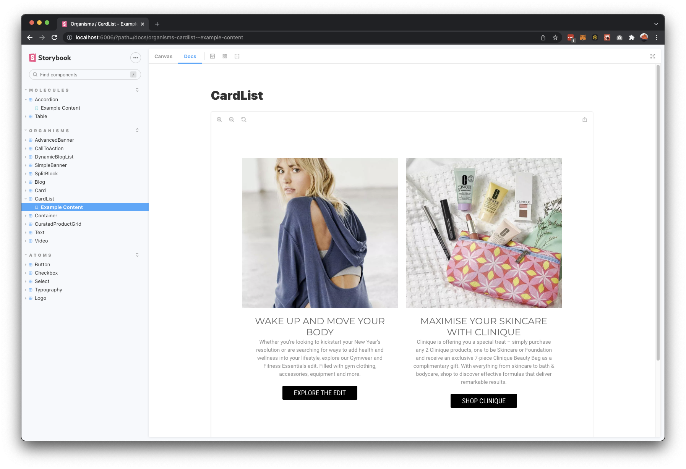

# Amplience Demo Store Core Package

`dc-demostore-core` is a React/Material/NextJS front-end e-Commerce application, implemented with Typescript, showcasing Amplience Dynamic Media and Dynamic Content.

It includes Storybook, a visual documentation of the UI components, things like Product Lists, Banners, Blogs & Blog posts, Stores, etc.

The package also includes a Debug/X-Ray panel to help understand how the pages and components are structured, what context your are looking at the application in and the ability to click directly from the application to the related content in Amplience Dynamic Content.

`dc-demostore-core` is intended for DEMO PURPOSES ONLY, and *not* for production-optimized environments.

# Table of Contents
- [Getting Started](#getting-started)
- [Storybook](#storybook)
- [Provisioning your own Amplience Environment)](#provisioning-your-own-amplience-environment)
- [Additional Topics](#additional-topics)


# Getting Started

## Dependency versions
This demo appliction was developed and tested with:

- Node version `18.x`
- NPM version `9.x`

## General Use (w/o Amplience account)

Out of the box, `dc-demostore-core` may be used without needing to have an Amplience account, allowing you to experiment with API calls and Front-End customisations against an existing content base. You can simply clone this repository and it already points to a working account so that you can see:

 - Live Content
 - Components
 - Amplience API requests
 - etc.

 The following commands will install `dc-demostore-core` on your local machine.

```sh
$ gh repo clone amplience/dc-demostore-core
$ cd dc-demostore-core
$ npm install / npm i
```

### To run a Development environment:

```sh
$ npm run dev
```

### To run a production environment:

```sh
$ npm run build
$ npm run start
```

Both dev and prod commands will also start a localhost. Then go to [http://localhost:3000](http://localhost:3000)


# Storybook

Firing up Storybook is super simple:

```sh
$ npm run storybook
```

Then go to http://localhost:6006. More details may be found in our [Storybook README](docs/Storybook.md)



# Provisioning your own Amplience Environment

The main tool for using your own Amplience environment with `dc-demostore-core` is `dc-demostore-cli`. The CLI tool allows you to quickly import a pre-configured set of Content Schemas, Content Types, Images, etc. to your Amplience acount. Basically, everything you'd see running `dc-demostore-core` OOTB against our 'core public' Amplience Environment.

At a high level the basic steps are:

1. [Request an Amplience Media and Dynamic Account (if you don't already have one)](#requesting-an-amplience-environment)
2. [Deploy a fork of `dc-demostore-core` (we'll cover deploying on Vercel)](#fork--deploy-dc-demostore-core)
3. Configure & use `dc-demostore-cli` to populate content
4. Point `dc-demostore-core` to your Dynamic Content Hub and run

## Requesting an Amplience Demo Store Environment

This application is setup to run with a predefined Amplience account structure to have all of the capabilities and organisational requirements to showcase capabilities effectively.

This section assumes you are already an Amplience partner, customer, or internal Amplience team member with access to the Amplience Support Center. IF the answer to any one of these is yes, [go here for instructions on requesting a Demo Store Environment](docs/DemoEnvironmentRequest.md)

If you already have a Dynamic Content and Dynamic Media instance, you can skip to the [next step](#fork--deploy-dc-demostore-core).

## Fork & Deploy `dc-demostore-core`

Go [HERE for some basic instructions](docs/ForkDeploy.md) on Forking and deploying core.

## Configure & Use `dc-demostore-cli`

Please refer directly to the [this README on how to Install/Configure/Use the CLI tool](https://github.com/amplience/dc-demostore-cli)

Once you have installed the `demostore` CLI tool, you can provision your account in two easy steps:

1. Register your instance using the CLI command `env add`

```sh
% demostore env add 
✔ env name: · mydcinstance
✔ app deployment url: · https://mydomain.com
✔ cms client id: · zzzzzzzz-yyyy-yyyy-yyyy-xxxxxxxxxxxx
✔ cms client secret: · ****************************************************************
✔ cms hub id: · xxxxxxxxxxxxxxx
✔ dam username: · youremail@domain.com
✔ dam password: · ********
info: [ amprsatest ] configure dc-cli...
info: [ amprsatest ] environment active
info: run [ env,add ]: started at Mon Mar 28 2022 12:39:21 GMT+0200 (Central European Summer Time)
```

2. You can provision your instance using the CLI command `import` [(more information on the CLI tool project page)](https://github.com/amplience/dc-demostore-cli):

```sh
% demostore import --latest
info: run [ import ]: started at Mon Mar 28 2022 12:45:26 GMT+0200 (Central European Summer Time)
...
...
...
info: run completed in [ 3m20s ]
```

> Note: If you ever need to revert, simply run the `cleanup` command.

## Change dc-demostore-core Config / Point to your account
- Create a .env.local file on the root of your project:

Default setting:

```sh
NEXT_PUBLIC_DEMOSTORE_CONFIG_LOCATOR=amprsaprod:default
```

Your setting with your Hub Name {hubname}

```sh
NEXT_PUBLIC_DEMOSTORE_CONFIG_LOCATOR={hubname}:default
```


If you are using services like Vercel, you can configure the environment variable in the settings, and re-deploy your application.

[top](#table-of-content)


## Additional Topics
- [Features Highlights](docs/FeatureHiLites.md)
- [High-Level Architecture](docs/ArchDiagram.md)
- [Available Components](docs/Components.md)
- [Exploring features](docs/DeepDive.md)
- [Contribution Model (fork, PR, etc.)](https://github.com/amplience/dc-cli/blob/master/CONTRIBUTING.md)
- [FAQ](docs/FAQ.md)