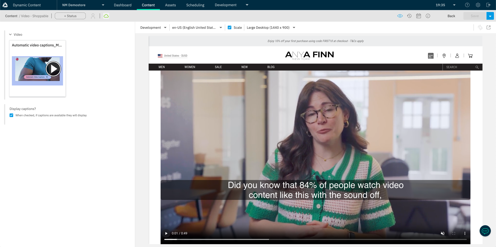

# Automated Video Captions

The Amplience platform has released the ability to automaticaly create video captions for a video.



## Pre-requisites

**Amplience:**

-   Content Hub
-   Dynamic Media
-   Access to setup video transcode profiles
-   Amplience Credits

**Configuration:**

-   Video with audio (speech suitable for captions)
-   Setup your transcode profile for captions
-   Assign the transcode profile to your video
-   Video to be published with captions

## Technical implementation

The video component can be found in this project at the following path `components/cms-modern/Video/Video.tsx`

This component allows the user to toggle captions on or off. If they are on it will attempt to load the captions for the video to display.

Example:

```js
{
    captions && (
        <track
            label="English"
            kind="captions"
            srcLang="en"
            src={`https://cdn.c1.amplience.net/c/${video.endpoint}/${video.name}-captions-en-US`}
            default
        />
    );
}
```

> Note: This demo is coded to work with English subtitles - see implementation notes below for a more generic solution approach.

### Cross domain

If your application is strict on security, you may wish to whitelist the domain in your security policy `https://cdn.c1.amplience.net` as well as amend your video tag to have its `crossOrigin` attribute set to "anonymous"

Example:

```html
<video crossorigin="anonymous" />
```

See the video component for implementation.

## Walkthrough

1. Create your transcoding profile for captions for en-US following the [documentation](https://amplience.com/developers/docs/user-guides/assets/video/#captions-options)

2. Upload a video to Content Hub. For this demo, ensure there is speech in English. An example can be found [here](https://amp-product.s3.eu-west-1.amazonaws.com/examples/video/Automatic_video_captions_Master_no_sub.mp4)

3. Assign both your default profiles to the video and your new captions profile for en-US. For reference the default profiles are:

    - `mp4_720p`
    - `mp4_480p`
    - `webm_720p`
    - `webm_480p`

4. Once the transcodes are complete, you can preview the video & publish.

5. Create a new piece of content in the Amplience Dynamic Content CMS and use this video with captions enabled.

## Notes for an actual implementation

1. The manual steps for assigning profiles to videos and publishing can be automated as part of a bulk upload job.
2. This demo is coded for English captions. In a dynamic implementation each video might have captions in different languages. Your front end should support this. See [Calling the delivery API for video data](#calling-the-delivery-API-for-video-data)

### Calling the delivery API for video data

You can draw everything you need dynamically for a video by calling the Delivery Video API when a video is published.

Example request:
`https://cdn.media.amplience.net/v/nmrsaalphatest/Automatic video captions_Master_no sub.json?metadata=true&protocol=https`

Will provide all of the information required to render a video which include:

-   The video title: `meta.title`
-   The video description: `meta.description`
-   Image to display as the main thumbnail: `meta.mainThumb.src`
-   Captions available for the video `meta.metadata.captions`
    -   Each is in the format `"{language}-{country}": "{captions-name}"`
    -   Example: `"en-US": "Automatic video captions_Master_no sub-captions-en-US"` where the `captions-name` would be used to constuct the captions URL and the `language` would be used to populate the `srcLang` attribute in the track tag for the video
-   A full list of transcode profiles to display `<source>` tags for the video: `media []`
-   Lots more that can be found on the [Amplience Dynamic Media Playground](https://playground.amplience.com/di/app/#/video)

> Note: If you have captions as separate profiles for rendering you may wish to omit them from dynamic drawing using the `profile` or `profileLabel` attribute

## Reading Materials

-   [Docs](https://amplience.com/developers/docs/user-guides/assets/video/#captions-options)
-   [Blog](https://amplience.com/blog/automatically-generate-video-captions-Amplience/)
-   [Release Notes](https://amplience.com/developers/docs/release-notes/2024/auto-captions/)

[back](../README.md)
