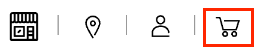
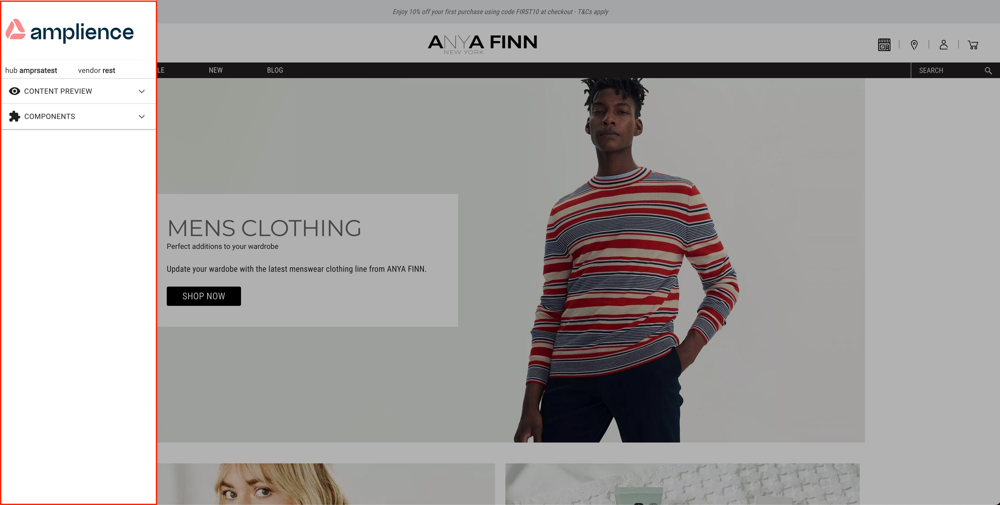
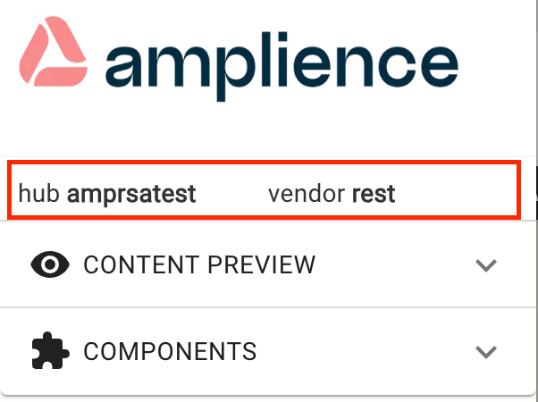
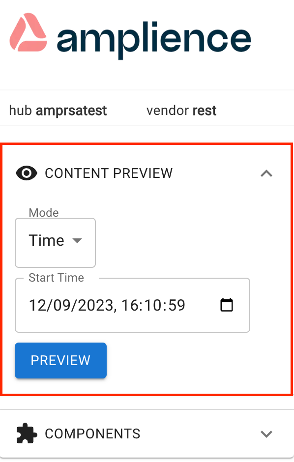
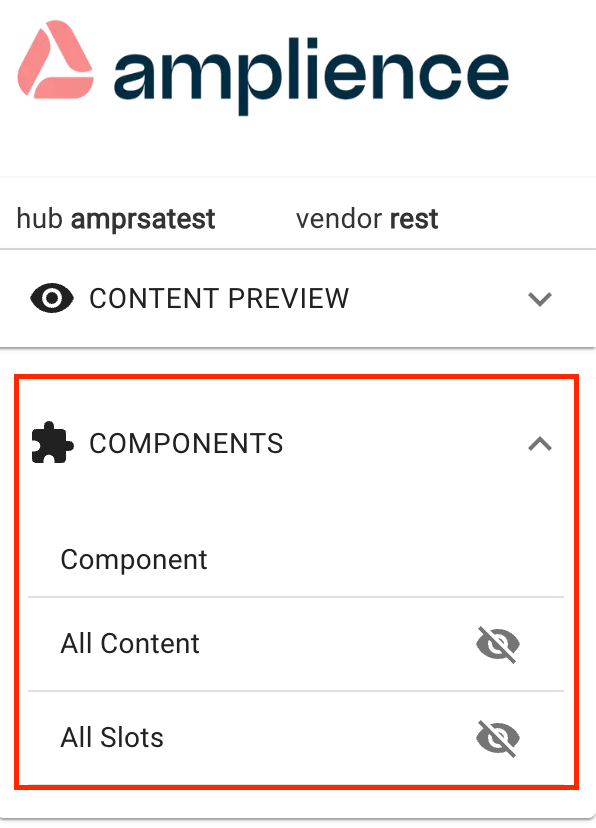
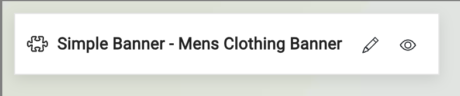
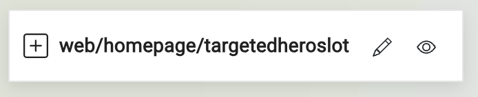

# Debug / X-Ray Panel

Demostore comes with a debug / X-Ray panel which shows the Amplience configuration being used.

## Accessing the X-Ray panel

Simply click on the shopping cart icon in the masthead

This will launch a side drawer from the left containing your X-Ray panel.

To close just click off the X-Ray Panel

## Hub and Vendor Displays

At the top of the X-Ray panel are 2 items which tell you information about your configuration of the demostore:

* Hub - The connected Amplience Dynamic Content Hub
* Vendor - The eCommerce vendor configuration used

## Content Preview

The content preview panel can be expanded to let you choose which mode you are seeing the content in:

* Production - Published content only
* Staging - Last saved versions of all content
* Time - allows you to select a time to see content scheduled for that time 

## Components

The Components preview panel allow you to toggle overlays on the website to give you information about what is on the page. Use the 'eye-cons' (icons) to show / hide

### Content Overlay

* Click the pencil icon to go directly into Authoring this content item
* Click the 'eye-con' to view the published version of this content in isolation 

* Click the pencil icon to go directly into Authoring this slot
* Click the 'eye-con' to view the published version of this slot in isolation 