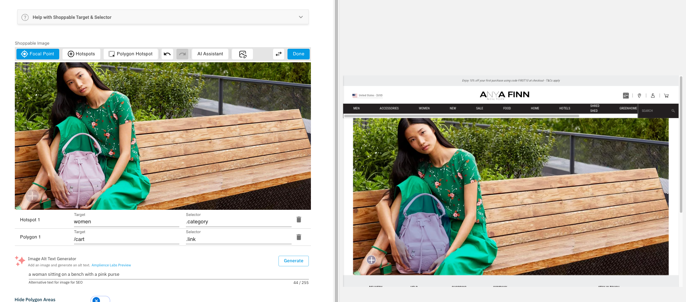
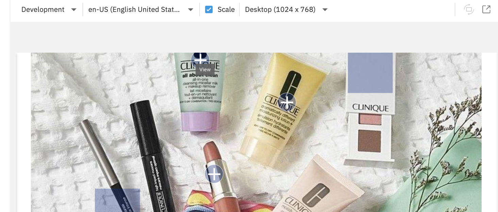
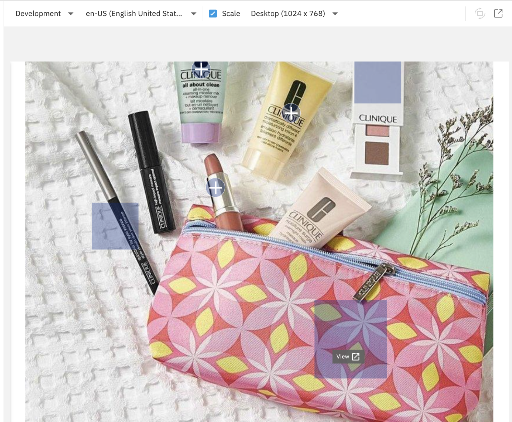
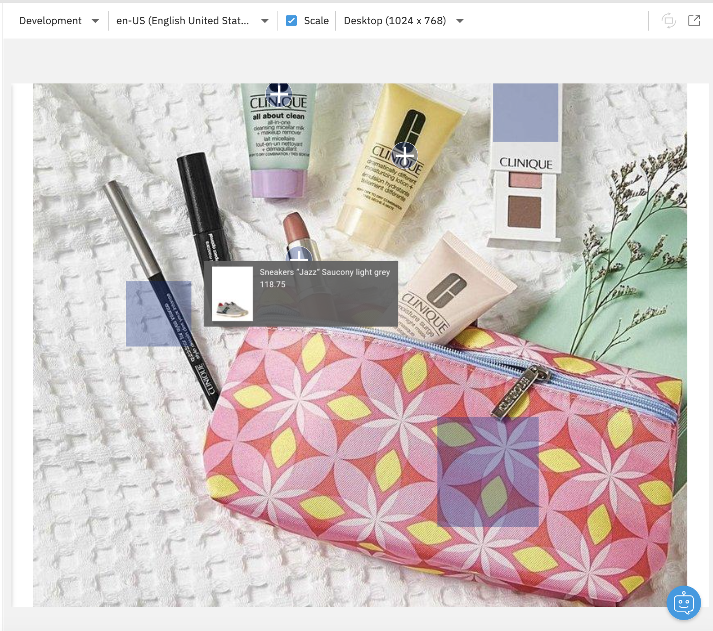
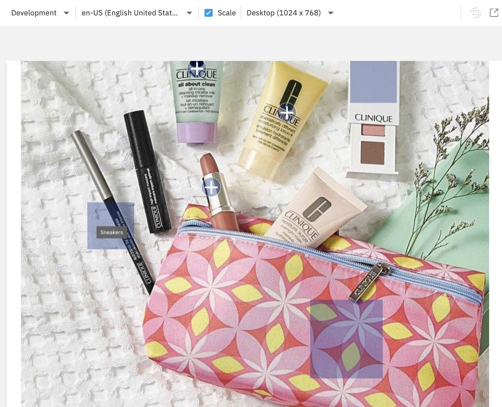
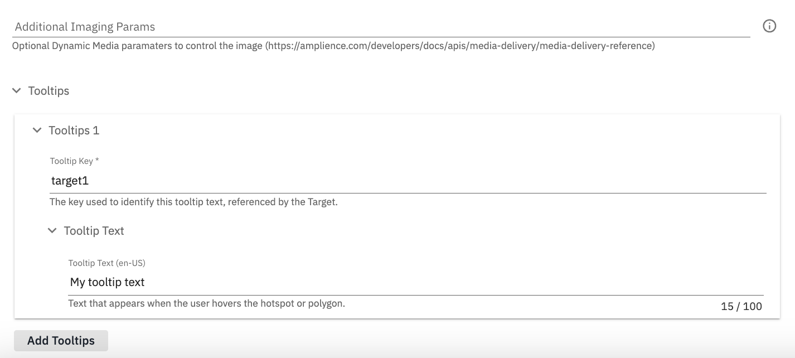

# Table of Contents
- [Fetching content](#fetching-content)
- [Filter API](#filter-api)
- [Amplience Search](#amplience-search)
- [Navigation Hierarchy](#navigation-hierarchy)
- [Product Detail Page Layout](#product-detail-page-layout)
- [Personalisation](#personalisation)
- [Theming](#theming)
- [Admin UI Panels](#admin-ui-panels)
- [Shoppable Image](#shoppable-image)
- [Stylitics](#stylitics)
- [Accelerated Media](#accelerated-media)

## Fetching content

### Content Delivery API

```js
const resolveContent = (requests: CmsRequest[]): Promise<CmsContent[]> => {
        return fetch(
            `https://${host}/content/fetch`,
                {
                    method: 'POST',
                    headers: { 'Content-Type': 'application/json' },
                    body: JSON.stringify({
                        "parameters": {
                            "depth": parameters.depth,
                            "format": parameters.format,
                            "locale": context.locale
                        },
                        "requests": requests
                    })
                }
            ).then(x => x.json())
                .then(x => x.responses || []) 
                .then(x => x.map((y: any) => y.content || null));
    };
```

[top](#table-of-contents)

## Filter API

### Sample Code

```js
const resolveFilter = (request: GetByFilterRequest): Promise<CmsFilterResponse> => {
        return fetch(
            `https://${host}/content/filter`,
                {
                    method: 'POST',
                    headers: { 'Content-Type': 'application/json' },
                    body: JSON.stringify({
                        ...request,
                        "parameters": {
                            "depth": parameters.depth,
                            "format": parameters.format
                        }
                    })
                }
            ).then(x => x.json());
    }
```

### Using Filter API


```js
let filterRequest: GetByFilterRequest =
    {
      filterBy: [
        {
          path: "/_meta/schema",
          value: "https://demostore.amplience.com/content/store"
        },
        {
          path: "/filterActive",
          value: true
        }
      ],
      sortBy: {
        key: "default",
        order: sortOrder
      }
    };

    if (parkingChecked) {
      filterRequest.filterBy.push({ path: "/keyElements/parking", value: true });
    }

    if (clickCollectChecked) {
      filterRequest.filterBy.push({ path: "/keyElements/clickAndCollect", value: true });
    }
```

[top](#table-of-contents)

## Amplience Search


### Setting up Instant Search

```js
        const search = instantsearch({
            indexName: stagingApi ? `${cms.hub}.blog-staging` : `${cms.hub}.blog-production`,
            searchClient: algoliasearch(
                appId,
                apiKey 
            ),
            hitsPerPage: 5,
        });
```
### Filtering

```js
        search.addWidget(
            instantsearch.widgets.configure({
                filters:
                    (locale || 'en-US').indexOf('en-') === 0
                        ? `locale:en-US`
                        : `locale:${locale}`,
                }),
        );
```

### Search Box

```js
        search.addWidget(
            instantsearch.widgets.searchBox({
                container: '#searchbox',
                placeholder: 'Search',
            })
        );
```

### Refinements

```js
        search.addWidget(
            instantsearch.widgets.refinementList({
                container: '#category-list',
                attribute: 'snippet.category',
            })
        );

        search.addWidget(
            instantsearch.widgets.refinementList({
                container: '#author-list',
                attribute: 'snippet.author',
            })
        );
```

### Hits

```js
        search.addWidget(
            instantsearch.widgets.hits({
                hitsPerPage: 5,
                container: '#hits',
                cssClasses: {
                    list: 'amp-dc-card-list-wrap',
                    item: 'amp-dc-card',
                },
                templates: {
                    item: ({ snippet, _meta }: any) => {
                        return `
                            <a ...>
                                ...
                            </a>
                    `;
                    },
                },
            })
        );
```

### Pagination

```js
        search.addWidget(
            instantsearch.widgets.pagination({
                container: '#pagination',
            })
        );
```

### Hits per page

```js
        search.addWidget(
            instantsearch.widgets.hitsPerPage({
                container: '#hits-per-page',
                items: [
                    { label: '5 hits per page', value: 5, default: true },
                    { label: '10 hits per page', value: 10 },
                ],
            })
        );
```

### JSX Template

```jsx
            <PageContent className="blog-list__container">
                <div className="blog-list">
                    <div className="blog-list-facets">
                    <Typography variant="h6">
                        <Breadcrumb navigationItem={navigationItem} />
                      </Typography>
                      <Typography variant="h2" component="h2">
                          Blog
                      </Typography> 
                        <div id="searchbox" className="ais-SearchBox" />
                        <ProductFacet title="Categories" className="blog-list-facet blog-list-facet--categories">
                            <div id="category-list" />
                        </ProductFacet>
                        <ProductFacet title="Author" className="blog-list-facet">
                            <div id="author-list" />
                        </ProductFacet>
                        <div id="hits-per-page" style={{ display: 'none' }} />
                    </div>
                    <div className="blog-list-results">
                        <div className="amp-dc-card-list amp-dc-prod-5-rows amp-dc-cards-hero amp-dc-cards-blog">
                            <div id="hits" />
                        </div>
                        <div id="pagination" />
                    </div>
                </div>
            </PageContent>
```

[top](#table-of-contents)

## Navigation Hierarchy


The `Site Pages` hierarchy defines the top navigation of the site.
This hierarchy is always loaded server-side and available for the Next.js pages.

Each commerce related node (Site Pages and Category Page) have an option populate sub nodes from commerce.


When set to true, the navigation will auto populate sub items from the commerce category (or root).

If set to false, only CMS managed sub items will appear.

CMS managed sub items will display AFTER the commerce items.

The default automation has the Site Pages node set to true to automatically render sub items from commerce.


Other sub-hierarchies like `Components` and `Themes` are also always loaded in.

```js
    const data = await fetchPageData({
        ...input,
        content: {
            ...input.content,
            configComponents: { key: 'config/components' }
        },
        hierarchies: {
            ...input.hierarchies,
            pages: {
                tree: { key: 'homepage' }
            },
            themes: {
                tree: { key: 'configuration/themes' }
            }
        }
    }, context);
```

[top](#table-of-contents)

## Product Detail Page Layout

Demostore features product detail page layouts that can be specific to:
- a category
- a product
- a Designer (could be any product attribute)

A specific UI Extension allows you to change the whole layout of the product detail page.
There is a default product layout with delivery key `layout/default-pdp`.
The `Commerce Experiences` hierarchy allows you to map categories, products, designers to specific layouts.
In the code, the Filter API is used to search Commerce Experiences based on the context (product categories, product ID, product attributes).

## Personalisation

In order to illustrate a personalisation approach this project contains a slot type which allows a user to associate content to user segments.

- Repository: `slots`
- Content type: `Personalized Banner Slot`
- Schema: `https://demostore.amplience.com/slots/personalized-banner`
- Component: `components/cms-modern/PersonalizedBannerSlot/PersonalizedBannerSlot.tsx`

### Authoring

When using this slot type in the scheduler you can add multiple items and associate user segments to each item in order to illustate working with personalised content in Amplience.

> Note about slots usage: Slots are designed to be created in the content library but the content of which is designed to be used in the Scheduling.


#### Rules

* You can have multiple items in your slot
* Each item can be associated to one or more segments
* An item without segments associated is 'default' content

> Note: This is just one approach for demonstration purposes.

### Previewing (Site preview)

When previewing and testing your personlised banner slot behavior, you must be in a FULL site preview, not just the slot preview.

To select a user segment click on the user icon in the top nav:


Then select a segment to preview, or select the blank item to behave as if you are not signed in:


The following rules will apply to all instances of the personalised banner slot in your application.

#### Rules

* If there are no items, nothing will display
* If you are NOT signed in (with a user segment):
  * It will display the FIRST item without a user segment associated
  * If no content is found without a segment it will display nothing
* If you ARE signed in (with a user segment):
  * It will display the FIRST item matching the user segment signed in with
  * If no matches are found it will:
    * Display default content (the FIRST item without a user segment aassociated)
    * If no content is found without a segment it will display nothing

### Layouts


### Commerce Experiences


### Getting default layout and related product content

```js
const [data, product] = await Promise.all(
    [
      fetchStandardPageData(
        {
          content: {
            defaultPDPLayout: pdpLayout ? { id: pdpLayout as string } : { key: 'layout/default-pdp' },
            productContent: { key: "product/" + id },
          },
        },
        context
      ),
      getProduct({ id }, cmsContext, userContext)
    ]
  );
```

### Configuration based on category

```js
  // config based on category
  product.categories.forEach((category: any) => {
    experienceConfigRequests.push(
      {
        filterBy: [
          {
            path: '/_meta/schema',
            value: 'https://demostore.amplience.com/site/experiences/category'
          },
          {
            path: '/id',
            value: category.id
          }
        ],
        sortBy: {
          key: 'default',
          order: 'desc'
        },
        page: {
          size: 1
        }
      }
    )
  });
```

### Config based on SKU

```js
  // config based on SKU
  experienceConfigRequests.push(
    {
      filterBy: [
        {
          path: '/_meta/schema',
          value: 'https://demostore.amplience.com/product-experience'
        },
        {
          path: '/id',
          value: product.id
        }
      ],
      sortBy: {
        key: 'default',
        order: 'desc'
      },
      page: {
        size: 1
      }
    }
  );
```

### Config based on Designer

```js
// config based on designer
  let designer = _.find(product?.variants?.[0]?.attributes, (att: Attribute) => att.name === 'designer')
  
  if (designer) {
    experienceConfigRequests.push(
      {
        filterBy: [
          {
            path: '/_meta/schema',
            value: 'https://demostore.amplience.com/site/experiences/designer'
          },
          {
            path: '/designer',
            value: designer
          }
        ],
        sortBy: {
          key: 'default',
          order: 'desc'
        },
        page: {
          size: 1
        }
      }
    );
  }
```

[top](#table-of-contents)

## Theming

In the `Configuration` hierarchy, you can create `Themes` with `Palette` and `Typography`.
You can define a default theme, and additional ones. Some components like `Blog` can use a `Theme`, and you can also wrap any component with a `ThemeWrapper` to change the theme locally.

### Default Theme


### Typography


### Palette


### Theme Wrapper


[top](#table-of-contents)

## Admin UI Panels


Admin UI Panels allow you to access some admin features useful for testing your application and content.
You can for instance switch from `Production` to `Staging` mode, show all components, slots or editions on the screen.
You can add your own panels in the `AdminPanel` component.

```js
const panels = [
  {
    label: 'Content Preview',
    icon: VisibilityIcon,
    component: ContentPreviewPanel
  },
  {
    label: 'Components',
    icon: ExtensionIcon,
    component: ComponentsPanel
  }
]
```

## Shoppable Image

This extension allows users to define Focal Points and interactable Hotspots over an image, in a format similar to what Content Hub provides, but with the data being stored on a content item.



The [dc-extension-shoppable-image](https://github.com/amplience/dc-extension-shoppable-image) is hosted on GitHub and this alpha version of the component has been added to Demo Store Core. Note: POI is not implemented in the Component yet but will be in a future release.

There are several options that you can put in the selector column that drive specific functionality from the information in the target.

| Target          | Selector                |
| --------------- | ----------------------- |
| Absolute URL to a page on any site or relative page on this site<br/>`https://amplience.com` | `.link` |
| Absolute URL to a page on any site or relative page on this site, opening in a new tab<br/>`https://amplience.com` | `.linkNew` |
| The ID of the product<br/>`123456789` | `.product` |
| The slug of the category<br/>`women-bags` | `.category` |
| The delivery key of a content item<br/>`content/richttext1` | `.deliveryKey` |
| The key of a tooltip<br/>`tooltip/tooltip1` | `.tooltip` |

### `.link` Link selector



The target is a relative or absolute link.

### `.linkNew` Link New selector



The specified absolute link will open in a new tab.

### `.product` Product selector



The tooltip with show the product thumbnail, title and price.

When a product is not found, the tooltip will show "Product not found".

### `.category` Category selector



The tooltip will show the category name.

When a category is not found, the tooltip will show "Category not found".

### `.deliveryKey` Content selector


The piece of content matching the delivery key will appear in a drawer.

### `.tooltip` Tooltip selector



Tooltip texts are first defined in the Tooltips section of the content form. The keys can then be used in the targets of `.tooltip` selectors.

## Stylitics

Uses the [Amplience Stylitics Integration (See link for full documentation)](https://github.com/amplience/dc-integration-stylitics) to render Stylitics widgets as a component. Stylitics and Amplience are a great fit for our creating automated shoppable experience using the great capabilities of Stylitics to increase AOV and basket size.

The demostore implementation includes the following:
* Sample product set that can be used when selecting products (see [documentation](https://github.com/amplience/dc-integration-middleware/blob/main/docs/vendor/commerce/rest.md))
* All of the component and implementation in React/NextJS
* Sample implementation for overriding link values
* Sample implementation of inheriting SKU from PDP

[top](#table-of-contents)

## Accelerated Media

A new [Accelerated Media](https://amplience.com/add-on/accelerated-media) Admin Panel has been added to the demostore implementation.

### Enable / Disable Accelerated Media

You can enable / disable Accelerated Media in the Admin Panel:


The use of AVIF format is globally controlled on the Front-End in all demostore pages:

* Home page
* Category pages
* Product detail pages, including Product Content
* Blog page & blog entry pages
* Stores page & store detail pages

### Getting Image Statistics

You can request image statistics for the current page:


The number of Amplience images in the page is displayed, and a summary graph is displayed in the Admin Panel with total sizes by image formats.

> Note: images statistics are cleared each time you navigate to a different page.

> Note: you should scroll down the current page to get all images due to lazy loading.


When images can't be converted to AVIF, a checkbox will appear to exclude these images from the summary graph calculation.

### Image Statistics Details

Once image statistics are retrieved, you can access details in a new modal window:


A grid view shows you all images with a bar chart showing each possible formats and their sizes, ordered by size.


In the details modal, images that can't be converted will appear with a red outline, showing the original request type, and the acutal type that is returned.


A list view shows the same information in a table view that you can export as CSV.


[top](#table-of-contents)