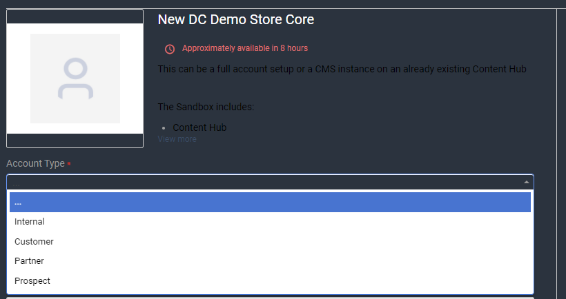

# Requesting a Demo Store Environment

First, head over to [https://support.amplience.com](https://support.amplience.com/) and login. 

On the home page click "Request New Service".


In the search field on that page, search for "demo", you should see "New DC Demo Store Core". Click on that option.


On the request page, select the Account Type (Internal, Customer, Partner, or Prospect).



Next, you'll select between two Setup Types:

## CMS Instance on existing Content Hub


### Name of existing Content Hub Account

TODO

### Hub Name and label

These can be anything you want, just follow the guidlines in the form. 

### Users
This should be provided in the following format:

```bash
First Last - email@address.com
First Last - email@address.com
First Last - email@address.com
```

### Asset Store Choice

TODO

## Full Account Setup


### Hub Name and label
These can be anything you want, just follow the guidlines in the form. 

### FTP 

If you require FTP access, sellect Yes. If not, select no or leave blank.

### Users

This should be provided in the following format:

```bash
First Last - email@address.com
First Last - email@address.com
First Last - email@address.com
```

Finally, if you are requesting the environment for someone else, check the "Request for someone else" box on the right and enter their email address so they are notified when the request is complete.

