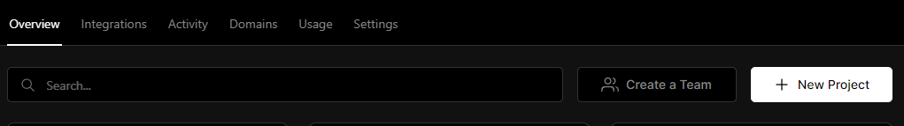
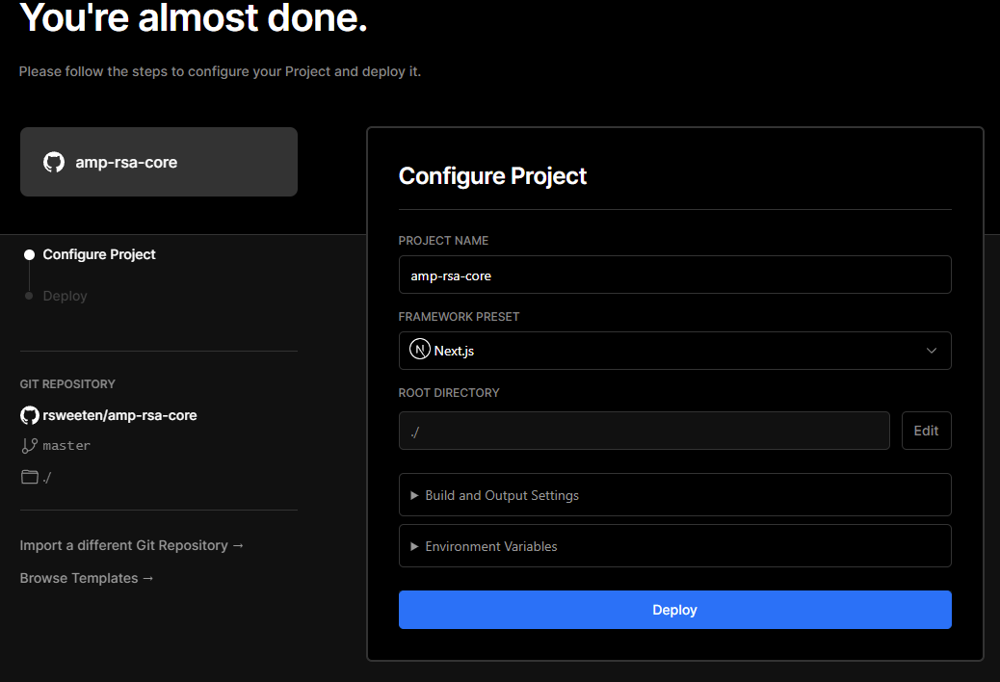

# Fork & Deploy `amp-rsa-core`

Before starting to use `amp-rsa-cli`, you'll need to delopy a fork of this project to something like Vercel or Netlify. We'll cover Vercel here, but you can choose any deployment platform. So, start by forking this repo, then head over to [Vercel](https://vercel.com/) to create a new project pointing to your fork. Hobby accounts are free, go ahead and create one if you don't already have one.

Then click "New Project"

It'll prompt you to import one of your repositories. Click Import for your forked version of `amp-rsa-core`:

On the next screen you can simply click "Deploy"

Once depoyed, you'll see this screen:

Note the URL under "Domains" (highlighted above). You'll need that when configuring `amp-rsa-cli` in the next step.

[back](../README.md)