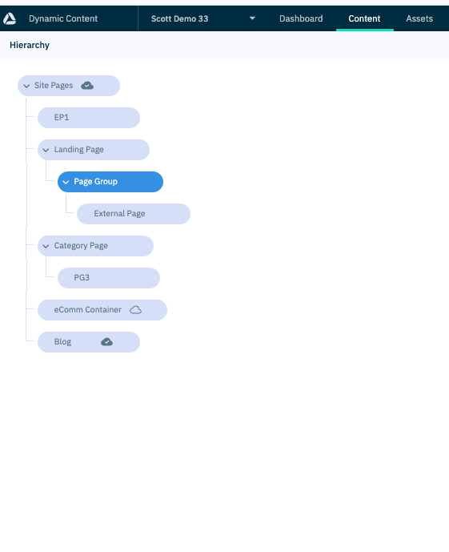

# Working with pages

The concepts of pages are a key demonstrable area of Demostore. They exist in 2 main areas:

### Navigation:

-   **Landing Page** - A pure CMS driven page. An item and standalone page for content only. Via Page Group can link to a Category Page, External Page or another Landing Page. Shows as a CMS Item on hover in the visualisation.

-   **Category Page** - Links directly to a commerce category and allows CMS content. An item & page linked to a Commerce category (PLP), to which Page Groups or further Category Pages can be added. Shows as a CMS Override Item on hover in the visualisation.

-   **Ecommerce Container** - Allows to you to draw all Ecommerce Categories into a single node - via Show All switch. Alternatively, select and reorder multiple Ecommerce Categories so you can control the order in which they appear in that existing node. Furthermore, you can use multiple Ecommerce Containers to distribute Ecommerce Categories amongst the CMS items. Shows as a Commerce Item on hover in the visualisation.

Show All above, below is selected Ecommerce Categories:

-   **External Page** - Menu item that links to an external URL. As this links to an External site, there are no further items that can be added. Displays as CMS Item on hover in the visualisation.

-   **Page Group** - A grouping for sub nodes of any type with the exception of External Pages and Ecommerce Containers.

### Standalone:

-   **Content Page** - A page which can be used by itself without being in the menu.

## Ordering in Navigation

Each of the navigation items mentioned above can be arranged by dragging and dropping in the left-hand-side hierarchy menu. This provides a powerful and flexible way to arrange items in the menu according to preference.

Existing drag-and-drop functionality, eg dragging a Page Group from a Landing Page to a Category Page continues to be available.

When creating / adding an Ecommerce Container, you have two options:

1. When the 'Show All' toggle switch is checked (default option), this will pull in all the Ecommerce Categories in the order they are obtained from the CMS.

2. When it is unchecked you will be able to manually select and arrange the eCommerce categories via drag-and-drop inside of the Ecommerce Container. In addition to the drag-and-drop re-ording function, here are a number of other functions available to enhance the user experience such as Move to top, Add below, Move to top etc

> Note: A Page Group can only be added as a child of a Category Page or Landing Page.

## Hiding a page

Each of these content types has a flag in the content form called `is Active` which defaults to true.

If you disable this, then the page is no longer visible if attempting to visit it directly or in the menu navigation.

## Archiving a page & delivery keys

Best practice when archiving a page is to follow the steps below:

1. Set the page to not be active & save
   a) If the page was previously published then unpublish.
2. Change the delivery key to something random & save
   b) Delivery keys are mandatory so you can use the same path and append a unique id using an online tool such as [Short UUID Generator](https://generateuuid.online/short-uuid). Example `category/6vYaP46nCukXc2DPTpnXZP`
3. If the page is part of the navigation you should also remove the node so that the parent link is no longer attached for staging content. See [Removing a node from a hierachy](https://amplience.com/developers/docs/dev-tools/guides-tutorials/hierarchies/#removing-a-node-from-a-hierarchy)

This will ensure that your content is not still visible when removed and your delivery key can be re-used again.

> Note: When using [dc-demostore-cli](https://github.com/amplience/dc-demostore-cli) to cleanup an account, this process is automated.
